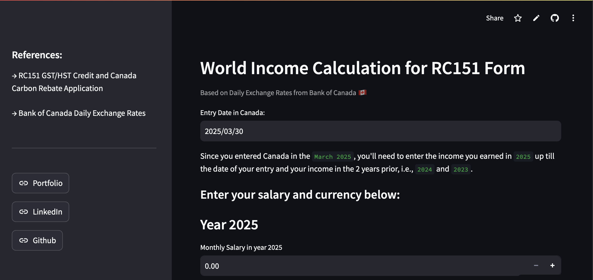

# Hello, I'm Shefali Sharma 👋

## 🚀 About Me
I live in Toronto, ON. I am currently employed with CIBC and possess 5 years of experience in Financial Industry.   **I am passionate to harness the power of data to drive meaningful change.** 

---
# 📊 Data Projects:

|  | **[RC151 Assistant Github](https://github.com/shefaliisharma/RC151Assistant)**   WebApp using Streamlit & Pandas   **Technologies**: Python   _Click on the image to open the app_ |
|------------------------------------------------------------------------------------------------|:-----------------------------------------------------------------------------------------------------------------------------------------------------------------------------------------------|
|                  |                                                                                                               |
| **[Apple Music Dataset SQL Analysis](https://shefaliisharma.github.io/holymoly)**              | **[IMDb Dataset Analysis](https://shefaliisharma.github.io/goodgrief/)**                                                                                                                       |
| Exploratory Analysis \| **Technologies**: SQL & Python                                         | Storytelling with Data \| **Technologies**: SQL & Tableau                                                                                                                                      |

---
## 🛠️ Tools & Technologies Overview:

| Tech        | Expertise       |
|-------------|:----------------|
| SQL         | 🟢 🟢 🟢 🟢 ⚪️  |
| Python      | 🟢 🟢 🟢 ⚪️ ⚪️  |
| Power Query | 🟢 🟢 🟢 🟢 🟢  |
| Tableau     | 🟢 🟢 🟢 🟢 🟢  |
| Alteryx     | 🟢 🟢 🟢 🟢 ⚪️  |
| Ms Access   | 🟢 🟢 🟢 🟢 ⚪️  |

I use Microsoft Excel, Power Query, Tableau and Alteryx daily at my current role in CIBC, Toronto ON. 

## 💼 Professional Experience

* **Sr. Business Analyst at CIBC** \| Jul, 2024 - Current 
  - Build new and improved the accuracy & reliability of the existing business intelligence dashboards in Tableau.
  - Automate business process using Microsoft PowerQuery and Alteryx
  - Support Project Managers with their budget reporting & spending analysis
* **Equity Data Analyst at Bloomberg** \| Apr, 2022 - Feb, 2024
  - Supported Bloomberg Functions: FA \<GO\>, MODL \<GO\>, EE \<GO\>
  - Specialized in managing and enhancing financial datasets through internal systems and proprietary software of Bloomberg.
  - Was involved in analyzing market regulations & trends, improving data processes, and collaborating across departments within several business initiatives to support product development.
  - Collaborated with diverse teams to improve data quality and functionality.
* **Financial Analyst at J.P. Morgan** \| Apr, 2020 - Apr, 2022
  - Collaborated across finance departments to support reporting requirements, working on various projects and resolving system issues to enhance reporting accuracy and efficiency.
  - Continuously improved business process efficiency and automated them using Alteryx and Tableau.

### 👩🏽‍💻 Online Certifications 
- Exploratory Data Analysis in SQL, **Datacamp** \| [View Certificate](assets/shefalisharma_sql_certificate.pdf) 
- Window Functions Course, **LearnSQL.com** \| [View Certificate](https://learnsql.com/files/course-certificate/iqlEgEvksirjTtDbcqmNZzDIOVwYamjRlKvFQwMa)
- Financial & Valuation Modeling, **Wall Street Prep** \| [View Credential](https://certification.wallstreetprep.com/b6d09be6-abab-4fcd-90d0-79ce1fc62bad#gs.6vkwhw)
- Using Python for Research, **HarvardX** \| [View Credential](https://courses.edx.org/certificates/e4060b141ad241769b9c3d3204a3bc93) 

### 🤝 Connect with Me

#### I am eager to work on any interesting project that makes a meaningful impact. Let's connect!
- LinkedIn: [Shefali Sharma](https://www.linkedin.com/in/shefaliisharma/)
- Email: [shefali.finance@gmail.com](mailto:shefali.finance@gmail.com)

