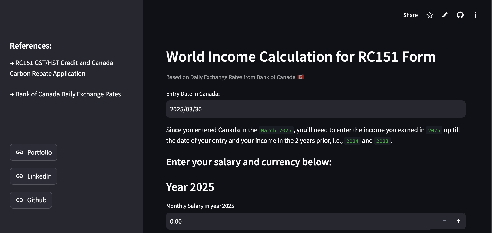

# Hello, I'm Shefali Sharma 👋

## 🚀 About Me
I live in Toronto, ON. I am currently employed with EQ Bank and possess 6 years of experience in Financial Industry.   **I am passionate to harness the power of data to drive meaningful change.** 

---

# 📊 Data Projects:

|  | **[RC151 Assistant Github](https://github.com/shefaliisharma/RC151Assistant)**   WebApp using Streamlit & Pandas   **Technologies**: Python   _Click on the image to open the app_ |
|------------------------------------------------------------------------------------------------|:-----------------------------------------------------------------------------------------------------------------------------------------------------------------------------------------------|
|                  |                                                                                                               |
| **[Apple Music Dataset SQL Analysis](https://shefaliisharma.github.io/holymoly)**              | **[IMDb Dataset Analysis](https://shefaliisharma.github.io/goodgrief/)**                                                                                                                       |
| Exploratory Analysis \| **Technologies**: SQL & Python                                         | Storytelling with Data \| **Technologies**: SQL & Tableau                                                                                                                                      |

---
## 🛠️ Tools & Technologies

| Tech            | Expertise       |
|-----------------|:----------------|
| SQL             | 🟢 🟢 🟢 🟢 🟢  |
| Python (pandas) | 🟢 🟢 🟢 🟢 ⚪️  |
| Power Query / M | 🟢 🟢 🟢 🟢 🟢  |
| Tableau         | 🟢 🟢 🟢 🟢 🟢  |
| Power BI / DAX  | 🟢 🟢 🟢 🟢 ⚪️  |
| Alteryx         | 🟢 🟢 🟢 🟢 ⚪️  |
| Anaplan         | 🟢 🟢 🟢 🟢 ⚪️  |

Day to day I work in SQL Server and Python, building data pipelines and 
transformation logic across large lending and treasury datasets.

## 💼 Professional Experience

#### Senior Financial Analyst, Data Systems & Analytics — EQ Bank
*Jun 2025 – Present*

- Engineer SQL and Python pipelines feeding forecasting models across eight product lines — transforming loan-level data for 60,000+ loans and bulk-loading ~700,000 monthly records via ODBC
- Lead the in-house data workstream for a bank-wide Anaplan implementation with Deloitte, owning requirements, model build, and QA across four sprints
- Automated a manual recurring reserves report into a three-click SQL and Power Automate workflow
- Supported migration of commercial data to Microsoft Fabric and validated the medallion architecture (bronze and gold layers)

#### Senior Business Analyst — CIBC
*Jul 2024 – Jun 2025*

- Built and improved business intelligence dashboards in Tableau
- Automated aggregation of 100+ Excel spend reports with an Alteryx macro, cutting data-prep time from 6–8 hours to 15–20 minutes

#### Equity Data Analyst — Bloomberg
*Apr 2022 – Feb 2024*

  - Built a Python script for the Content Acquisition team using MODL earnings data, 
    surfacing key statistics to support data-provider negotiations
  - Used Bloomberg Query Language to analyze financial disclosures across an equity 
    data portfolio and validate data accuracy
  - Supported Bloomberg functions FA \<GO\>, MODL \<GO\>, EE \<GO\>

#### Financial Analyst — J.P. Morgan
*Apr 2020 – Apr 2022*

  - Reduced a 16-hour extraction and transformation process for trade, investor, and 
    regional metrics to under 10 minutes using SQL and Alteryx
  - Automated weekly wealth-management report distribution with a Python script

### 👩🏽‍💻 Certifications
- Anaplan Level 2 Model Builder
- Window Functions, **LearnSQL.com** | [View Certificate](https://learnsql.com/files/course-certificate/iqlEgEvksirjTtDbcqmNZzDIOVwYamjRlKvFQwMa)
- Using Python for Research, **HarvardX** | [View Credential](https://courses.edx.org/certificates/e4060b141ad241769b9c3d3204a3bc93)
- Exploratory Data Analysis in SQL, **DataCamp** | [View Certificate](assets/shefalisharma_sql_certificate.pdf)
- Financial & Valuation Modeling, **Wall Street Prep** | [View Credential](https://certification.wallstreetprep.com/b6d09be6-abab-4fcd-90d0-79ce1fc62bad#gs.6vkwhw)

### 🤝 Connect
- LinkedIn: [Shefali Sharma](https://www.linkedin.com/in/shefaliisharma/)
- Email: [shefali.finance@gmail.com](mailto:shefali.finance@gmail.com)

